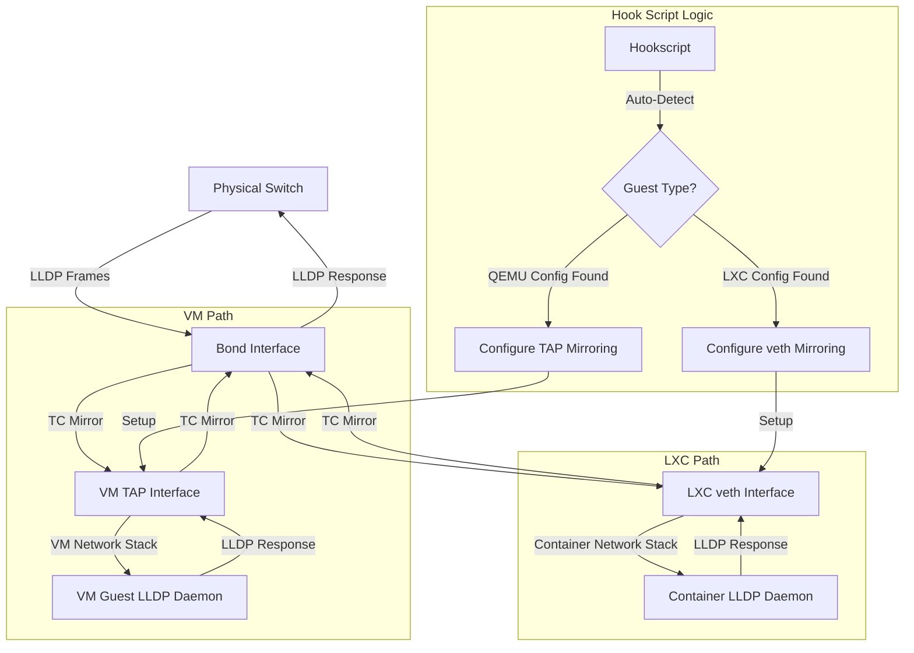

# Proxmox Universal LLDP Discovery Hook [🌐](https://github.com/lavacano/Proxmox-LLDP-Discovery)

> **Automatically enable LLDP network discovery for VMs and LXC containers on VLAN-aware bridges**

A production-ready hookscript that solves LLDP (Link Layer Discovery Protocol) visibility issues in Proxmox Virtual Environment by intelligently mirroring network discovery traffic between physical and virtual interfaces - supporting both QEMU/KVM VMs and LXC containers.

[](https://www.proxmox.com/)
[](https://opensource.org/licenses/MIT)
[](https://www.gnu.org/software/bash/)
[](https://www.qemu.org/)
[](https://linuxcontainers.org/)

---

## 🚀 Quick Start

### 1. Install Dependencies
```bash
apt update && apt install lldpd iproute2
systemctl enable --now lldpd
```

### 2. Install the Hook Script
```bash
# Create snippets directory if it doesn't exist
mkdir -p /var/lib/vz/snippets

# Download and install (replace with your actual URL)
wget -O /var/lib/vz/snippets/universal-lldp-hook.sh [YOUR_SCRIPT_URL]
chmod +x /var/lib/vz/snippets/universal-lldp-hook.sh
```

### 3. Configure Your Guests

**For VMs:**
```bash
# Edit VM config
nano /etc/pve/qemu-server/100.conf

# Add these lines:
hookscript: local:snippets/universal-lldp-hook.sh
lldp_mirror_net0=bond0
```

**For LXC Containers:**
```bash
# Edit container config  
nano /etc/pve/lxc/200.conf

# Add these lines:
hookscript: local:snippets/universal-lldp-hook.sh
lldp_mirror_net0=bond0
```

### 4. Verify LLDP Discovery
```bash
# Start/restart your VM or container
qm start 100    # For VMs
pct start 200   # For LXC

# Inside the guest, check LLDP neighbors
lldpcli show neighbors
```

---

## 🎯 What Problem Does This Solve?

### The Universal Challenge

In virtualized environments with VLAN-aware bridges, **both VMs and containers** lose network topology visibility:

- ❌ **Physical switch LLDP frames don't reach guest interfaces**  
- ❌ **Network discovery tools fail to map guest-to-switch connections**  
- ❌ **Automated network configuration breaks**  
- ❌ **Network administrators lose infrastructure visibility**  
- ❌ **Affects QEMU/KVM VMs AND LXC containers equally**

### The Universal Solution

This hookscript creates **intelligent bidirectional mirroring** of LLDP traffic between:
- 🔄 **Physical interfaces** ↔ **VM TAP interfaces** (for QEMU/KVM)
- 🔄 **Physical interfaces** ↔ **Container veth interfaces** (for LXC)
- 🎯 **LLDP traffic only** (EtherType 0x88cc)
- ⚡ **Zero impact** on regular network performance
- 🤖 **Automatic guest type detection** (VM vs Container)

---

## ✨ Key Features

| Feature | Benefit |
|---------|---------|
| 🌐 **Universal Support** | Works with both QEMU/KVM VMs and LXC containers |
| 🔍 **Auto-Detection** | Automatically detects guest type and adapts accordingly |
| 🔄 **Automatic Configuration** | Reads guest configs, no manual interface management |
| 🔒 **Idempotent Operation** | Safe to run multiple times, no duplicate rules |
| 📊 **Comprehensive Logging** | Detailed logs with automatic rotation and guest type tracking |
| 🛡️ **Robust Error Handling** | Graceful failures, comprehensive validation |
| 🔌 **Multi-Interface Support** | Handle complex guest network configurations |
| ⚙️ **Service Integration** | Auto-restarts LLDP daemon when needed |
| 💾 **Memory Efficient** | Minimal resource usage, targeted filtering |
| 🔧 **Production Ready** | Optimized for Proxmox 8.4+ with advanced TC operations |

---

## 📋 Requirements

### System Requirements
- **Proxmox VE**: 8.0+ (recommended: 8.4+)
- **Linux Kernel**: 4.15+ 
- **Guest Types**: QEMU/KVM VMs and/or LXC containers
- **Network Drivers**: 
  - VMs: VirtIO (recommended), E1000 supported
  - LXC: Native veth pairs

### Required Packages
```bash
# Install if not present
apt install lldpd iproute2
```

### Permissions
- Root access to Proxmox host
- Write access to `/var/lib/vz/snippets/`

---

## 🔧 Configuration Guide

### Universal Configuration Syntax

The configuration syntax is **identical** for both VMs and LXC containers. The script automatically detects the guest type and adapts its behavior accordingly.

### Method 1: Command Line (Recommended)

**QEMU/KVM Virtual Machine:**
```bash
nano /etc/pve/qemu-server/100.conf
```

**LXC Container:**
```bash
nano /etc/pve/lxc/200.conf
```

**Single Interface Example (works for both):**
```bash
# VM: net0 uses TAP interface (tap100i0)
# LXC: net0 uses veth interface (veth200i0)
net0: virtio=AA:BB:CC:DD:EE:FF,bridge=vmbr0,tag=10   # VM syntax
net0: name=eth0,bridge=vmbr0,tag=10,hwaddr=AA:BB:CC:DD:EE:FF   # LXC syntax

# Identical LLDP configuration for both:
hookscript: local:snippets/universal-lldp-hook.sh
lldp_mirror_net0=bond0
```

**Multi-Interface Example:**
```bash
# Guest network interfaces (syntax differs by type)
net0: virtio=AA:BB:CC:DD:EE:00,bridge=vmbr0,tag=10      # VM
net1: virtio=AA:BB:CC:DD:EE:01,bridge=vmbr1,tag=20      # VM
# OR for LXC:
# net0: name=eth0,bridge=vmbr0,tag=10,hwaddr=AA:BB:CC:DD:EE:00
# net1: name=eth1,bridge=vmbr1,tag=20,hwaddr=AA:BB:CC:DD:EE:01

# Identical LLDP mirror configuration:
hookscript: local:snippets/universal-lldp-hook.sh
lldp_mirror_net0=bond0
lldp_mirror_net1=bond1
```

### Method 2: Web Interface

1. **VM/Container** → **Options** → **Hook Script** → Set to: `local:snippets/universal-lldp-hook.sh`
2. **Manually edit config file** to add `lldp_mirror_net[X]` parameters

### Configuration Reference

| Parameter | Format | Description | Example |
|-----------|---------|-------------|---------|
| `hookscript` | `local:snippets/script-name.sh` | Path to hookscript | `local:snippets/universal-lldp-hook.sh` |
| `lldp_mirror_net[X]` | `lldp_mirror_net[X]=[bond_name]` | Mirror guest net[X] to physical bond | `lldp_mirror_net0=bond0` |

**Universal Interface Mapping Logic:**
- **VMs:** `lldp_mirror_net0=bond0` → VM's `net0` (tap100i0) ↔ Host's `bond0`
- **LXC:** `lldp_mirror_net0=bond0` → Container's `net0` (veth200i0) ↔ Host's `bond0`
- **Missing entries:** No LLDP mirroring for that interface

---

## 📖 Real-World Examples

### 🏢 Mixed Environment: VM + LXC Infrastructure

**Database VM (ID 100):**
```bash
# /etc/pve/qemu-server/100.conf
net0: virtio=52:54:00:DB:00:00,bridge=vmbr0,tag=100  # Production DB VLAN
net1: virtio=52:54:00:DB:00:01,bridge=vmbr1,tag=200  # Backup VLAN
hookscript: local:snippets/universal-lldp-hook.sh
lldp_mirror_net0=bond0  # Primary uplink
lldp_mirror_net1=bond1  # Secondary uplink
```

**Web Server Container (ID 200):**
```bash
# /etc/pve/lxc/200.conf
net0: name=eth0,bridge=vmbr0,tag=10,hwaddr=52:54:00:WEB:00:00   # Public DMZ
net1: name=eth1,bridge=vmbr0,tag=999,hwaddr=52:54:00:WEB:00:01  # Management
hookscript: local:snippets/universal-lldp-hook.sh
lldp_mirror_net0=bond0  # Public interface gets LLDP
# net1 intentionally omitted - no LLDP for management
```

**Monitoring Container (ID 300):**
```bash
# /etc/pve/lxc/300.conf
net0: name=eth0,bridge=vmbr0,tag=500,hwaddr=52:54:00:MON:00:00  # Monitoring VLAN
hookscript: local:snippets/universal-lldp-hook.sh
lldp_mirror_net0=bond0
```

### 🌐 Service Provider Setup

**Customer VM (ID 1001):**
```bash
# High-performance VM with multiple customer VLANs
net0: virtio=52:54:01:01:00:00,bridge=vmbr0,tag=1001  # Customer A
net2: virtio=52:54:01:01:00:02,bridge=vmbr0,tag=1002  # Customer A DMZ
hookscript: local:snippets/universal-lldp-hook.sh
lldp_mirror_net0=bond0
lldp_mirror_net2=bond0
```

**Management Container (ID 2001):**
```bash
# Lightweight container for network monitoring
net0: name=eth0,bridge=vmbr0,tag=2000,hwaddr=52:54:02:01:00:00  # Management
hookscript: local:snippets/universal-lldp-hook.sh
lldp_mirror_net0=bond1  # Separate management uplink
```

---

## 📊 Monitoring & Logging

### 📂 Enhanced Log Output

The script now includes guest type information in all log entries:

```bash
/var/log/lldp-hook.log          # Current log with universal support
/var/log/lldp-hook.log.1        # Previous rotation
```

### 🔍 Monitoring Commands

```bash
# Follow real-time logs with guest type info
tail -f /var/log/lldp-hook.log

# Search for specific guest types
grep "QEMU/KVM" /var/log/lldp-hook.log        # VMs only
grep "LXC container" /var/log/lldp-hook.log   # Containers only

# Search for specific VM or container
grep "VMID: 100" /var/log/lldp-hook.log       # VM 100
grep "CTID: 200" /var/log/lldp-hook.log       # Container 200

# Check for errors across all guest types
grep ERROR /var/log/lldp-hook.log

# Monitor interface types being configured
grep -E "(TAP|veth)" /var/log/lldp-hook.log
```

### 📈 Sample Enhanced Log Output

```
2024-08-06 14:30:15 - === Universal LLDP Hookscript v4.0.0 started ===
2024-08-06 14:30:15 - Processing ID: 100, Phase: post-start
2024-08-06 14:30:15 - Detected QEMU/KVM virtual machine (VMID: 100)
2024-08-06 14:30:15 - Parsed qemu configuration:
2024-08-06 14:30:15 -   lldp_mirror_net0=bond0
2024-08-06 14:30:16 - Phase is post-start. Applying TC rules for qemu.
2024-08-06 14:30:17 - Waiting for qemu interfaces to be ready (max 30s)...
2024-08-06 14:30:18 - Interface bond0 (Physical) state: up, carrier: 1
2024-08-06 14:30:18 - Interface tap100i0 (TAP (VM)) state: up, carrier: 1
2024-08-06 14:30:18 - All required qemu interfaces are ready
2024-08-06 14:30:18 - Configuring: qemu net0 (tap100i0) <-> bond bond0
2024-08-06 14:30:18 - Setting up TC link for bond0 <-> tap100i0 (qemu)
2024-08-06 14:30:19 - TC mirror filters for bond0 <-> tap100i0 are active
2024-08-06 14:30:20 - Successfully restarted lldpd service
2024-08-06 14:30:20 - All LLDP mirror configurations applied successfully for qemu 100
2024-08-06 14:30:20 - === Universal LLDP Hookscript v4.0.0 finished for qemu 100 ===

2024-08-06 14:31:15 - === Universal LLDP Hookscript v4.0.0 started ===
2024-08-06 14:31:15 - Processing ID: 200, Phase: post-start
2024-08-06 14:31:15 - Detected LXC container (CTID: 200)
2024-08-06 14:31:15 - Parsed lxc configuration:
2024-08-06 14:31:15 -   lldp_mirror_net0=bond0
2024-08-06 14:31:16 - Phase is post-start. Applying TC rules for lxc.
2024-08-06 14:31:17 - Waiting for lxc interfaces to be ready (max 30s)...
2024-08-06 14:31:18 - Interface bond0 (Physical) state: up, carrier: 1
2024-08-06 14:31:18 - Interface veth200i0 (veth (LXC)) state: up, carrier: 1
2024-08-06 14:31:18 - All required lxc interfaces are ready
2024-08-06 14:31:18 - Configuring: lxc net0 (veth200i0) <-> bond bond0
2024-08-06 14:31:18 - Setting up TC link for bond0 <-> veth200i0 (lxc)
2024-08-06 14:31:19 - TC mirror filters for bond0 <-> veth200i0 are active
2024-08-06 14:31:20 - All LLDP mirror configurations applied successfully for lxc 200
2024-08-06 14:31:20 - === Universal LLDP Hookscript v4.0.0 finished for lxc 200 ===
```

---

## 🛠️ Troubleshooting

### Common Issues & Universal Solutions

<details>
<summary><strong>🚫 Script Not Detecting Guest Type</strong></summary>

**Symptoms:** Log shows "No valid configuration found"

**Quick Diagnostics:**
```bash
# Check if config files exist
ls -la /etc/pve/qemu-server/100.conf    # For VMs
ls -la /etc/pve/lxc/200.conf            # For LXC

# Verify guest is actually running
qm status 100    # For VMs
pct status 200   # For LXC

# Test script manually with different IDs
/var/lib/vz/snippets/universal-lldp-hook.sh 100 post-start
/var/lib/vz/snippets/universal-lldp-hook.sh 200 post-start
```

**Solutions:**
- Ensure guest ID matches config file name
- Verify config file permissions are readable
- Check that hookscript line is present in config
</details>

<details>
<summary><strong>🔌 Interface Naming Issues</strong></summary>

**Symptoms:** Log shows interface not found errors

**Quick Diagnostics:**
```bash
# List VM interfaces (when VM is running)
ip link show | grep "tap100"

# List LXC interfaces (when container is running) 
ip link show | grep "veth200"

# Check guest-specific interface patterns
ip link show | grep -E "(tap|veth)[0-9]+i[0-9]+"

# Verify physical bond interfaces
ip link show type bond
```

**Expected Interface Patterns:**
- **VMs:** `tap[VMID]i[NET_ID]` (e.g., tap100i0, tap100i1)
- **LXC:** `veth[CTID]i[NET_ID]` (e.g., veth200i0, veth200i1)

**Solutions:**
```bash
# Ensure guest is running before applying rules
qm start 100 && sleep 5  # For VMs
pct start 200 && sleep 3 # For LXC (faster startup)

# Verify network configuration in guest config
qm config 100 | grep net  # For VMs
pct config 200 | grep net # For LXC
```
</details>

<details>
<summary><strong>📝 LLDP Not Working in Guests</strong></summary>

**Symptoms:** TC rules appear correct but no LLDP neighbors visible

**Universal Diagnostics:**
```bash
# Check physical switch LLDP transmission
tcpdump -i bond0 ether proto 0x88cc -n

# Test LLDP daemon in guests
# For VMs:
qm enter 100
systemctl status lldpd

# For LXC:
pct enter 200  
systemctl status lldpd
```

**Guest-Specific Solutions:**

**In VMs:**
```bash
# Install lldpd if missing
apt install lldpd
systemctl enable --now lldpd
lldpcli show neighbors
```

**In LXC Containers:**
```bash
# Install lldpd (same as VMs)
apt install lldpd
systemctl enable --now lldpd

# Note: Some container templates may need additional setup
lldpcli show neighbors
```
</details>

<details>
<summary><strong>🔄 Mixed Environment Issues</strong></summary>

**Symptoms:** Some guests work, others don't in mixed VM/LXC environment

**Diagnostics:**
```bash
# Check all active guests
qm list | grep running    # Running VMs
pct list | grep running   # Running containers

# Compare working vs non-working configurations
grep -A5 -B5 lldp_mirror /etc/pve/qemu-server/*.conf
grep -A5 -B5 lldp_mirror /etc/pve/lxc/*.conf

# Check interface availability across guest types
for type in tap veth; do
  echo "=== $type interfaces ==="
  ip link show | grep "$type"
done
```

**Solutions:**
- Ensure consistent configuration syntax across guest types
- Verify physical bond interfaces exist for all mappings
- Check that network bridges are properly configured for both VMs and containers
</details>

### 🔧 Advanced Universal Diagnostics

```bash
# Complete mixed environment status check
echo "=== Proxmox Version ==="
pveversion

echo "=== Running Guests ==="
qm list | grep running
pct list | grep running

echo "=== Network Interfaces ==="
echo "Bond interfaces:"
ip -d link show type bond
echo "VM interfaces:"
ip link show | grep "tap[0-9]"
echo "LXC interfaces:"  
ip link show | grep "veth[0-9]"

echo "=== LLDP Hook Configurations ==="
echo "VM configs with LLDP:"
grep -l lldp_mirror /etc/pve/qemu-server/*.conf 2>/dev/null
echo "LXC configs with LLDP:"
grep -l lldp_mirror /etc/pve/lxc/*.conf 2>/dev/null

echo "=== TC Rules by Interface Type ==="
for bond in bond0 bond1; do
  if ip link show "$bond" &>/dev/null; then
    echo "--- $bond ---"
    tc qdisc show dev "$bond" | grep ingress
    tc filter show dev "$bond" parent ffff: | grep -A1 0x88cc
  fi
done

echo "=== LLDP Service Status ==="
systemctl status lldpd --no-pager
```

---

## 🏗️ Technical Architecture

### Universal Interface Handling



### Interface Detection Logic

| Guest Type | Config Location | Interface Pattern | Example |
|------------|-----------------|-------------------|---------|
| **QEMU/KVM** | `/etc/pve/qemu-server/` | `tap[VMID]i[NET_ID]` | `tap100i0` |
| **LXC** | `/etc/pve/lxc/` | `veth[CTID]i[NET_ID]` | `veth200i0` |

### Traffic Control Rules (Universal)

The TC rules created are **identical** regardless of guest type - only the target interface changes:

**For VMs:**
```bash
# VM TAP interface mirroring
tc filter replace dev bond0 parent ffff: prio 1 protocol 0x88cc \
  u32 match u16 0x88cc 0xffff at -2 \
  action mirred egress mirror dev tap100i0
```

**For LXC:**
```bash  
# LXC veth interface mirroring  
tc filter replace dev bond0 parent ffff: prio 1 protocol 0x88cc \
  u32 match u16 0x88cc 0xffff at -2 \
  action mirred egress mirror dev veth200i0
```

---

## 📊 Performance & Compatibility

### Performance Impact
- **CPU Overhead**: Negligible for both VMs and containers
- **Memory Usage**: Minimal kernel structure overhead per guest
- **Network Latency**: No measurable impact on regular traffic
- **Mixed Environment**: No additional overhead when running both VMs and containers

### Universal Compatibility Matrix

| Proxmox VE | QEMU/KVM VMs | LXC Containers | Universal Support |
|------------|--------------|----------------|-------------------|
| **8.4+** | ✅ **Optimal** | ✅ **Optimal** | ✅ **Full Support** |
| **8.0-8.3** | ✅ **Stable** | ✅ **Stable** | ✅ **Full Support** |
| **7.x** | ⚠️ **Legacy** | ⚠️ **Legacy** | ⚠️ **Partial Support** |
| **6.x** | ❌ **Unsupported** | ❌ **Unsupported** | ❌ **Not Supported** |

### Guest Type Support Matrix

| Feature | QEMU/KVM VMs | LXC Containers | Notes |
|---------|--------------|----------------|-------|
| **Interface Detection** | ✅ TAP interfaces | ✅ veth pairs | Automatic |
| **Multi-Interface** | ✅ Multiple NICs | ✅ Multiple NICs | Same config syntax |
| **VLAN Support** | ✅ VLAN-aware bridges | ✅ VLAN-aware bridges | Native support |
| **Hot-Plug Interfaces** | ⚠️ Restart required | ⚠️ Restart required | Limitation of hook system |
| **Nested Virtualization** | ✅ Supported | ❌ N/A | VM-specific feature |

---

## 🤝 Contributing

We welcome contributions for both VM and LXC support improvements!

### 🐛 Reporting Issues
**Please include:**
- Proxmox VE version (`pveversion`)
- **Guest type** (VM or LXC) and ID
- Relevant log excerpts showing guest type detection
- Guest configuration snippet with network setup
- Expected vs actual behavior

### 💡 Feature Requests
**Consider including:**
- Which guest types the feature should support
- Mixed environment use cases  
- Performance implications for both VMs and containers

### 🛠️ Code Contributions
**Guidelines:**
- Maintain universal compatibility (both VMs and LXC)
- Add appropriate guest type logging
- Test with both QEMU/KVM VMs and LXC containers
- Consider mixed environment scenarios
- Update documentation for both guest types

### 📝 Documentation
- Add examples for both VMs and containers
- Expand troubleshooting for mixed environments
- Include guest-type-specific configuration notes

---

## 🆕 What's New in v4.0.0

### Universal Guest Support
- ✨ **LXC Container Support** - Full support for LXC containers alongside existing VM support
- 🔍 **Automatic Guest Detection** - Script detects VM vs LXC automatically
- 🌐 **Universal Configuration** - Same configuration syntax works for both guest types
- 📊 **Enhanced Logging** - Guest type information included in all log entries

### Performance Optimizations  
- ⚡ **Optimized TC Operations** - Using 'replace' for atomic, idempotent rule management
- 🚀 **Streamlined Parsing** - Single AWK process eliminates external command overhead
- 💾 **Memory Efficiency** - Reduced process creation in high-frequency scenarios

### Production Enhancements
- 🛡️ **Robust Error Handling** - Improved error detection and recovery for mixed environments
- 🔄 **Enhanced Interface Validation** - Better validation for both TAP and veth interfaces  
- 📈 **Advanced Monitoring** - Guest-type-aware diagnostics and troubleshooting

---

## 📄 License

This project is licensed under the **MIT License** - see the [LICENSE](LICENSE) file for details.

### MIT License Summary
- ✅ **Commercial use** - Perfect for service providers with mixed VM/LXC environments
- ✅ **Modification** - Adapt for your specific infrastructure needs
- ✅ **Distribution** - Share with the Proxmox community
- ✅ **Private use** - Use in private/enterprise environments
- ❌ **Liability** - Use at your own risk
- ❌ **Warranty** - No warranty provided

---

## ⚠️ Important Notes

### Universal Compatibility
> **Note**: This script automatically detects whether you're using QEMU/KVM VMs or LXC containers and adapts accordingly. The same configuration syntax works for both guest types.

### Production Usage
> **Important**: This script modifies network traffic control rules on your Proxmox host for both VMs and containers. While designed to be safe and idempotent, **always test in a non-production environment first** with both guest types you plan to use.

### Mixed Environments
> **Best Practice**: When running both VMs and containers, monitor the logs to ensure proper guest type detection. The script handles mixed environments seamlessly, but verify each guest type is properly configured.

---

## 🙏 Acknowledgments

- **Proxmox VE Community** for ongoing support and feedback on both VM and LXC features
- **Linux Containers (LXC) Project** for the excellent containerization technology
- **QEMU/KVM Community** for robust virtualization capabilities  
- **Linux Traffic Control (TC)** maintainers for the versatile networking tools
- **LLDP Protocol Specification** contributors
- **All contributors** who helped extend this script to support both VMs and containers

---

**Made with ❤️ for the entire Proxmox community - VMs and containers alike!**

*Supporting both traditional virtualization and modern containerization for comprehensive network discovery.*
