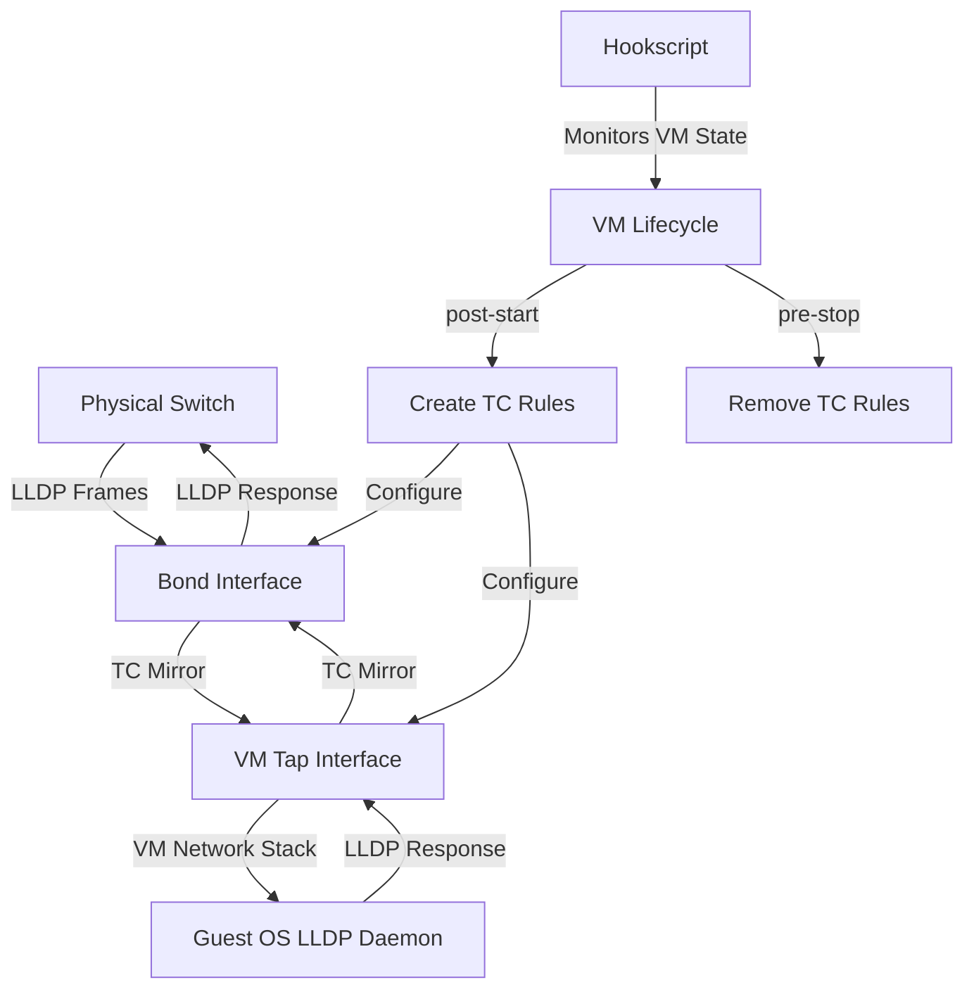

# Proxmox LLDP Discovery Fix 🔗

> **Automatically enable LLDP network discovery for VMs on VLAN-aware bridges**

A production-ready hookscript that solves LLDP (Link Layer Discovery Protocol) visibility issues in Proxmox Virtual Environment by intelligently mirroring network discovery traffic between physical and virtual interfaces.

[](https://www.proxmox.com/)
[](https://opensource.org/licenses/MIT)
[](https://www.gnu.org/software/bash/)

## 🚀 Quick Start

**1. Install dependencies**
```bash
apt update && apt install lldpd iproute2
systemctl enable --now lldpd
```

**2. Install the hookscript**
```bash
# Download and install
mkdir -p /var/lib/vz/snippets
wget -O /var/lib/vz/snippets/universal-lldp-hook.sh https://raw.githubusercontent.com/lavacano/Proxmox-LLDP-Discovery/refs/heads/main/optimized_lldp_hook_v33.sh
chmod +x /var/lib/vz/snippets/universal-lldp-hook.sh
```

**3. Configure your VM**
```bash
# Edit VM config file
nano /etc/pve/qemu-server/100.conf

# Add these lines:
hookscript: local:snippets/universal-lldp-hook.sh
lldp_mirror_net0=bond0
```

**4. Restart your VM and verify**
```bash
# Inside the VM, check LLDP neighbors
lldpcli show neighbors
```

---

## 🎯 What Problem Does This Solve?

### The Challenge
In virtualized environments with VLAN-aware bridges, VMs lose network topology visibility:

- ❌ **Physical switch LLDP frames don't reach VM interfaces**  
- ❌ **Network discovery tools fail to map VM-to-switch connections**  
- ❌ **Automated network configuration breaks**  
- ❌ **Network administrators lose infrastructure visibility**  

### The Solution
This hookscript creates **intelligent bidirectional mirroring** of LLDP traffic between:
- 🔄 **Physical bond interfaces** ↔ **VM tap interfaces**
- 🎯 **LLDP traffic only** (EtherType 0x88cc)
- ⚡ **Zero impact** on regular network performance

---

## ✨ Key Features

| Feature | Benefit |
|---------|---------|
| 🔄 **Automatic Configuration** | Reads VM configs, no manual interface management |
| 🔒 **Idempotent Operation** | Safe to run multiple times, no duplicate rules |
| 📊 **Comprehensive Logging** | Detailed logs with automatic rotation |
| 🛡️ **Robust Error Handling** | Graceful failures, comprehensive validation |
| 🔌 **Multi-Interface Support** | Handle complex VM network configurations |
| ⚙️ **Service Integration** | Auto-restarts LLDP daemon when needed |
| 💾 **Memory Efficient** | Minimal resource usage, targeted filtering |

---

## 📋 Requirements

### System Requirements
- **Proxmox VE**: 8.0+ (recommended: 8.4+)
- **Linux Kernel**: 4.15+ 
- **Network Driver**: VirtIO (recommended), E1000 supported

### Required Packages
```bash
# Install if not present
apt install lldpd iproute2
```

### Permissions
- Root access to Proxmox host
- Write access to `/var/lib/vz/snippets/`

---

## 🔧 Configuration Guide

### Method 1: Command Line (Recommended)

Edit your VM configuration file directly:

```bash
nano /etc/pve/qemu-server/[VMID].conf
```

**Single Interface Example:**
```bash
net0: virtio=AA:BB:CC:DD:EE:FF,bridge=vmbr0,tag=10
hookscript: local:snippets/universal-lldp-hook.sh
lldp_mirror_net0=bond0
```

**Multi-Interface Example:**
```bash
net0: virtio=AA:BB:CC:DD:EE:00,bridge=vmbr0,tag=10
net1: virtio=AA:BB:CC:DD:EE:01,bridge=vmbr1,tag=20
net2: virtio=AA:BB:CC:DD:EE:02,bridge=vmbr0,tag=30
hookscript: local:snippets/universal-lldp-hook.sh
lldp_mirror_net0=bond0
lldp_mirror_net1=bond1
lldp_mirror_net2=bond0
```

### Method 2: Web Interface

1. **VM** → **Options** → **Hook Script** → Set to: `local:snippets/universal-lldp-hook.sh`
2. **Manually edit config file** to add `lldp_mirror_net[X]` parameters

### Configuration Reference

| Parameter | Format | Description | Example |
|-----------|---------|-------------|---------|
| `hookscript` | `local:snippets/script-name.sh` | Path to hookscript | `local:snippets/universal-lldp-hook.sh` |
| `lldp_mirror_net[X]` | `lldp_mirror_net[X]=[bond_name]` | Mirror VM net[X] to physical bond | `lldp_mirror_net0=bond0` |

**Interface Mapping Logic:**
- `lldp_mirror_net0=bond0` → VM's `net0` ↔ Host's `bond0`
- `lldp_mirror_net5=bond1` → VM's `net5` ↔ Host's `bond1`
- Missing entries = no LLDP mirroring for that interface

---

## 📖 Real-World Examples

### 🏢 Enterprise Multi-Tenant Setup
```bash
# VM 100: Database server with redundant connections
net0: virtio=52:54:00:12:34:00,bridge=vmbr0,tag=100  # Production VLAN
net1: virtio=52:54:00:12:34:01,bridge=vmbr1,tag=200  # Backup VLAN
hookscript: local:snippets/universal-lldp-hook.sh
lldp_mirror_net0=bond0  # Primary uplink
lldp_mirror_net1=bond1  # Secondary uplink
```

### 🌐 DMZ Web Server
```bash
# VM 200: Web server with public and management interfaces
net0: virtio=52:54:00:56:78:00,bridge=vmbr0,tag=10   # Public DMZ
net1: virtio=52:54:00:56:78:01,bridge=vmbr0,tag=999  # Management
hookscript: local:snippets/universal-lldp-hook.sh
lldp_mirror_net0=bond0  # Public interface gets LLDP
# net1 intentionally omitted - no LLDP for management
```

### 🔬 Development Environment
```bash
# VM 300: Dev server with multiple test networks
net0: virtio=52:54:00:AB:CD:00,bridge=vmbr0,tag=300  # Dev network
net2: virtio=52:54:00:AB:CD:02,bridge=vmbr0,tag=302  # Test network
net5: virtio=52:54:00:AB:CD:05,bridge=vmbr0,tag=305  # Staging
hookscript: local:snippets/universal-lldp-hook.sh
lldp_mirror_net0=bond0
lldp_mirror_net2=bond0
lldp_mirror_net5=bond0
```

---

## 📊 Monitoring & Logging

### 📂 Log Location
```bash
/var/log/lldp-hook.log          # Current log
/var/log/lldp-hook.log.1        # Previous rotation
/var/log/lldp-hook.log.2        # Older rotation
```

### 🔍 Monitoring Commands
```bash
# Follow real-time logs
tail -f /var/log/lldp-hook.log

# Search for specific VM
grep "VM 100" /var/log/lldp-hook.log

# Check for errors
grep ERROR /var/log/lldp-hook.log

# Monitor log size and rotation
ls -lh /var/log/lldp-hook.log*
```

### 📈 Sample Log Output
```
2024-08-06 14:30:15 - === Hookscript v3.3.0 started. VMID: 100, Phase: post-start ===
2024-08-06 14:30:15 - Found LLDP mirror configurations for VM 100:
2024-08-06 14:30:15 -   lldp_mirror_net0=bond0
2024-08-06 14:30:15 - Phase is post-start. Applying TC rules.
2024-08-06 14:30:16 - Waiting for network interfaces to be ready (max 30s)...
2024-08-06 14:30:18 - All required interfaces are ready
2024-08-06 14:30:18 - Setting up TC link for bond0 <-> tap100i0
2024-08-06 14:30:18 - TC mirror filters for bond0 <-> tap100i0 are active
2024-08-06 14:30:20 - Successfully restarted lldpd service
2024-08-06 14:30:20 - All LLDP mirror configurations applied successfully
2024-08-06 14:30:20 - === Hookscript v3.3.0 finished for VM 100 ===
```

---

## 🛠️ Troubleshooting

### Common Issues & Quick Fixes

<details>
<summary><strong>🚫 Script Not Executing</strong></summary>

**Symptoms:** No log entries when starting/stopping VMs

**Quick Diagnostics:**
```bash
# Check script exists and is executable
ls -la /var/lib/vz/snippets/universal-lldp-hook.sh

# Verify VM configuration
grep hookscript /etc/pve/qemu-server/[VMID].conf

# Test script manually
/var/lib/vz/snippets/universal-lldp-hook.sh 100 post-start
```

**Solutions:**
```bash
# Fix permissions
chmod +x /var/lib/vz/snippets/universal-lldp-hook.sh

# Check VM config syntax
qm config [VMID] | grep hookscript
```
</details>

<details>
<summary><strong>🔌 Interface Not Found Errors</strong></summary>

**Symptoms:** Log shows "interfaces do not exist" errors

**Quick Diagnostics:**
```bash
# List available bond interfaces
ip link show type bond

# List VM tap interfaces (VM must be running)
ip link show | grep "tap$(VMID)"

# Verify configuration
grep lldp_mirror /etc/pve/qemu-server/[VMID].conf
```

**Solutions:**
```bash
# Check physical interface names
ip addr show

# Verify VM is actually running
qm status [VMID]

# Wait longer for interface initialization (in script logs)
```
</details>

<details>
<summary><strong>🔄 TC Rules Not Working</strong></summary>

**Symptoms:** LLDP still not visible in VM

**Quick Diagnostics:**
```bash
# Check TC rules exist
tc qdisc show dev bond0 | grep ingress
tc filter show dev bond0 parent ffff: | grep 0x88cc

# Test LLDP in VM
lldpcli show neighbors

# Monitor LLDP traffic
tcpdump -i bond0 ether proto 0x88cc -n
```

**Solutions:**
```bash
# Manual rule test
tc qdisc add dev bond0 ingress
tc filter add dev bond0 parent ffff: protocol 0x88cc u32 match u8 0 0 \
  action mirred egress mirror dev tap100i0

# Restart LLDP daemon
systemctl restart lldpd

# Check VM network driver (should be virtio)
qm config [VMID] | grep net
```
</details>

<details>
<summary><strong>📝 No LLDP Data in VM</strong></summary>

**Symptoms:** Rules appear correct but no LLDP neighbors visible

**Quick Diagnostics:**
```bash
# Verify lldpd running in VM
systemctl status lldpd  # Inside VM

# Check if physical switch sends LLDP
tcpdump -i bond0 ether proto 0x88cc  # On host

# Verify VM interface names
ip addr show  # Inside VM
```

**Solutions:**
```bash
# Install lldpd in VM if missing
apt install lldpd
systemctl enable --now lldpd

# Check switch LLDP configuration
# (switch-specific commands)

# Verify correct physical interface mapping
ip link show master bond0
```
</details>

### 🔧 Advanced Diagnostics

```bash
# Complete system state check
echo "=== Proxmox Version ===" && pveversion
echo "=== Bond Interfaces ===" && ip -d link show type bond
echo "=== Bridge Configuration ===" && brctl show
echo "=== Active VMs ===" && qm list | grep running
echo "=== TC Rules Summary ===" && for i in bond0 bond1; do echo "--- $i ---"; tc qdisc show dev $i; done
echo "=== LLDP Service Status ===" && systemctl status lldpd --no-pager
```

---

## 🏗️ Technical Architecture

### How It Works



### Traffic Control Rules Created

**Ingress QDisc Setup:**
```bash
tc qdisc replace dev bond0 ingress      # Physical interface
tc qdisc replace dev tap100i0 ingress   # VM tap interface
```

**Bidirectional LLDP Mirroring:**
```bash
# Physical → Virtual
tc filter replace dev bond0 parent ffff: prio 1 protocol 0x88cc \
  u32 match u16 0x88cc 0xffff at -2 \
  action mirred egress mirror dev tap100i0

# Virtual → Physical  
tc filter replace dev tap100i0 parent ffff: prio 1 protocol 0x88cc \
  u32 match u16 0x88cc 0xffff at -2 \
  action mirred egress mirror dev bond0
```

### Interface Naming Convention

| Component | Naming Pattern | Example |
|-----------|----------------|---------|
| **VM ID** | Numeric | `100` |
| **Network Interface** | `net[X]` | `net0`, `net5` |
| **TAP Interface** | `tap[VMID]i[X]` | `tap100i0`, `tap200i5` |
| **Physical Bond** | `bond[X]` | `bond0`, `bond1` |
| **Mirror Config** | `lldp_mirror_net[X]` | `lldp_mirror_net0` |

---

## 📊 Performance & Security

### Performance Impact
- **CPU Overhead**: Negligible (processes ~1 frame per 30s)
- **Memory Usage**: Minimal kernel structure overhead  
- **Network Latency**: No measurable impact on regular traffic
- **Bandwidth**: LLDP frames are 300-1500 bytes every 30 seconds

### Security Considerations
- ✅ **Principle of Least Privilege**: Only mirrors LLDP traffic (0x88cc)
- ✅ **No Data Exposure**: Regular network traffic unaffected  
- ✅ **Minimal Logging**: Only operational data, no sensitive content
- ✅ **Isolated Rules**: TC rules don't affect other traffic types

### Compatibility Matrix

| Proxmox VE Version | Status | Notes |
|-------------------|---------|-------|
| 8.4+ | ✅ **Recommended** | Fully tested, optimal performance |
| 8.0-8.3 | ✅ **Supported** | Tested, stable operation |
| 7.x | ⚠️ **Legacy** | Should work, minor modifications may be needed |
| 6.x | ❌ **Unsupported** | Significant modifications required |

---

## 🤝 Contributing

We welcome contributions! Here's how you can help:

### 🐛 Reporting Issues
**Please include:**
- Proxmox VE version (`pveversion`)
- Relevant log excerpts from `/var/log/lldp-hook.log`
- VM configuration snippet
- Expected vs actual behavior

### 💡 Feature Requests
**Consider including:**
- Specific use case description
- Current limitations
- Proposed implementation approach

### 🛠️ Code Contributions
**Guidelines:**
- Follow existing code style and conventions
- Add appropriate logging for new features
- Test with multiple VM configurations
- Update documentation as needed
- Include test cases where possible

### 📝 Documentation
- Fix typos and improve clarity
- Add real-world examples
- Expand troubleshooting guides
- Translate to other languages

---

## 📄 License

This project is licensed under the **MIT License** - see the [LICENSE](LICENSE) file for details.

### MIT License Summary
- ✅ **Commercial use**
- ✅ **Modification** 
- ✅ **Distribution**
- ✅ **Private use**
- ❌ **Liability**
- ❌ **Warranty**

---

## ⚠️ Disclaimer

> **Important**: This script modifies network traffic control rules on your Proxmox host. While designed to be safe and idempotent, **always test in a non-production environment first**.
> 
> The authors are not responsible for any network disruption or system issues that may result from using this script. Use at your own risk.

---

## 🙏 Acknowledgments

- **Proxmox VE Community** for ongoing support and feedback
- **Linux Traffic Control (TC)** maintainers for the robust networking tools
- **LLDP Protocol Specification** contributors
- **All contributors** who have helped improve this script

---

**Made with ❤️ for the Proxmox community**
